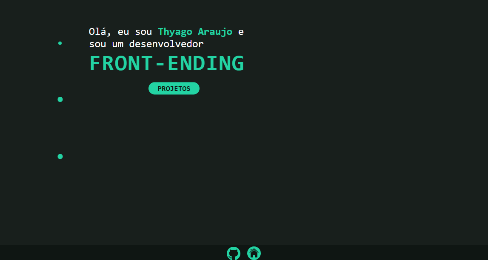
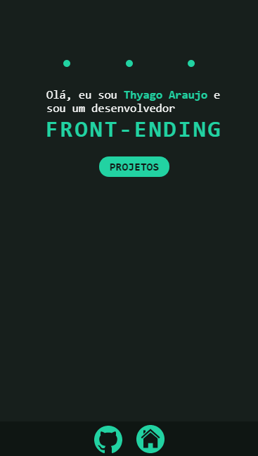

<h1 align="center">
     <a href="https://github.com/thyagoaraujom/portfolio" alt="Portfólio"> Portfólio</a>
</h1>

<h3 align="center">
   Repositório para o meu portfólio
</h3>

<p align="center">
  

  
  
  <a href="https://github.com/thyagoaraujom/README/commits/master">
    
  </a>
    
   
   <a href="https://github.com/thyagoaraujom/portfolio/stargazers">
    
  </a>
  
 
</p>

<h4 align="center">
	🚀 Completo 🚀
</h4>

<p align="center">
 <a href="#---sobre-o-repositório-">Sobre o projeto</a> •
 <a href="#--como-executar-o-projeto-">Como executar o projeto</a> •
 <a href="#-autor">Autor</a> • 
 <a href="#--Contributing">Contribuindo</a> • 
 <a href="#user-content--licença">Licença</a>
</p>

---

<h2 id="---sobre-o-repositório-" align="center"> 💻  Sobre o repositório </h2>

Este repositório será para o meu portifólio, com meus contatos e todos os meus projetos e trabalhos mais relevantes em um local só, com links para os repositórios e demos de cada um.

---

<h2 id="--como-executar-o-projeto-" align="center"> 🚀 Como executar o projeto </h2>

<p align="center"> Este projeto só usa Front-end ( Html, Css e Javascript).  </p>


Clique no link abaixo para ver a aplicação rodando no seu navegador <a href="https://thyagoaraujom.github.io/portfolio/" > Site </a>

### Pré-requisitos

Antes de começar, você vai precisar ter instalado em sua máquina as seguintes ferramentas:
[Git](https://git-scm.com) e um bom editor para trabalhar com o código como [VSCode](https://code.visualstudio.com/)

1. Faça clone do projeto:

```bash
$ git clone https://github.com/thyagoaraujom/FlexBlog.git

```

2. Abra com o editor de escolha.

---

<h2 align="center"> 🚀 Projeto </h2>

<h4 align="center"> Mobile </h4>
  <p align="center";>
   	
  </p>

<h4 align="center"> Web </h4>
<p align="center" style="display: flex; justify-content: center;">
  
</p>

---

<h2 id="--Contributing" align="center"> 🤝 Contribuindo </h2>

Este projeto é para fins de estudo, então me envie um e-mail me contando o que você está fazendo e por que está fazendo, me ensine o que você sabe

Todos os tipos de contribuições são muito bem-vindos e apreciados!

⭐️ Iniciar o projeto
</br>
🐛 Encontrar e relatar problemas
</br>
📥 Envie PRs para ajudar a resolver problemas ou adicionar recursos

---

<h2 id="-autor">Autor</h2>

<a href="https://github.com/thyagoaraujom">
 
</br>
<p> Thyago Araujo <p>
</a>

[](https://www.linkedin.com/in/thyago-araujo-m/)
[](mailto:thyagoaraujomotta@gmail.com)

---

<h2 id="user-content--licença"> 📝 Licença </h2>

Este projeto esta sobe a licença [MIT](./LICENSE.md).

Feito com ❤️ por Thyago Araujo 👋🏽 [Entre em contato!](https://www.linkedin.com/in/thyago-araujo-m/)

---
